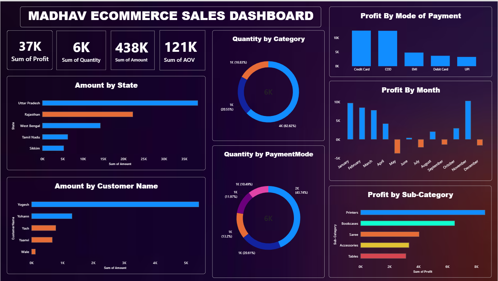

# 📊 Madhav Ecommerce Sales Analysis – Power BI

An interactive Power BI dashboard designed to analyze ecommerce sales, profit, quantity, customers, states, payment modes, and monthly performance.

## 📸 Dashboard Preview

## 🎯 Project Objective

The objective of this project is to analyze ecommerce sales data and create an interactive dashboard that helps identify sales trends, profitable products, customer performance, and regional performance.

## 📌 Key KPIs

- 💰 Total Profit
- 📦 Total Quantity
- 💵 Total Sales Amount
- 📈 Average Order Value

## 📊 Dashboard Analysis

The dashboard provides insights into:

- State-wise Sales
- Category-wise Quantity
- Payment Mode Distribution
- Monthly Profit Trends
- Customer-wise Sales
- Sub-category-wise Profit
- Overall Sales & Profit Performance

## 🛠️ Tools & Technologies

- Power BI
- Power Query
- DAX
- Microsoft Excel / CSV
- Data Visualization

## 📂 Project Files

| File | Description |
|------|-------------|
| `Dashboard.pbix` | Power BI dashboard file |
| `Orders.csv` | Orders dataset |
| `Details.csv` | Detailed sales dataset |
| `dashboard_preview.png` | Dashboard preview |

## 💡 Key Insights

- Identified high-performing states based on sales.
- Compared profitability across different product sub-categories.
- Analyzed monthly profit trends.
- Compared customer contributions to overall sales.
- Analyzed quantity distribution across categories and payment modes.

## 👩‍💻 Author

**Srushti Chavan**

### Skills Demonstrated

`Power BI` `DAX` `Power Query` `Data Cleaning` `Data Visualization` `Business Intelligence` `Data Analysis`
